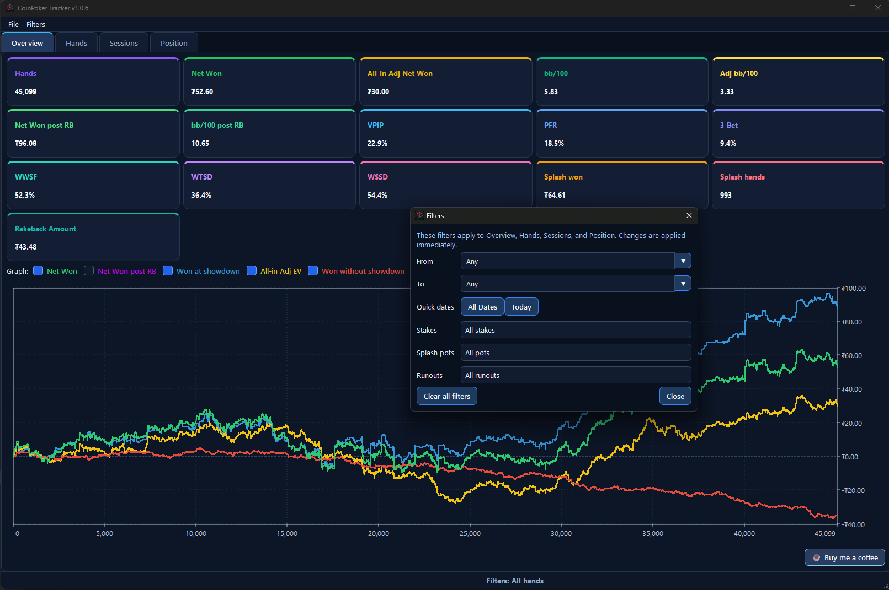
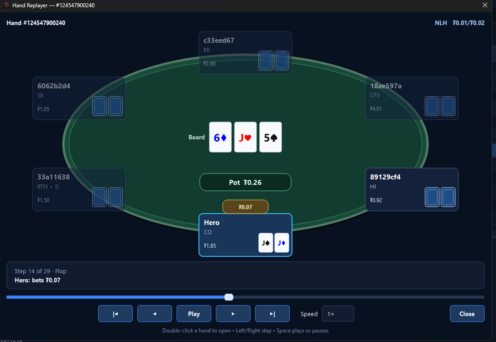
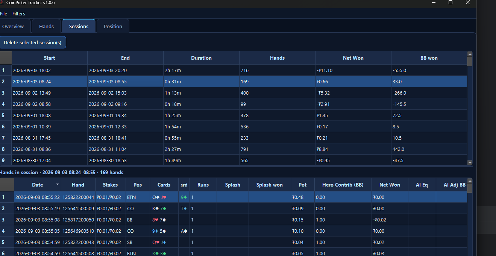

# CoinPoker Tracker

A simple, lightweight cash-game tracker for **CoinPoker** on Windows.

CoinPoker Tracker imports your local CoinPoker hand-history files and gives you a clean way to review results, basic poker stats, sessions, positions, all-in adjusted results, and profit graphs.

It is intentionally a **simple tracker**, not a full poker analysis suite.

## Download

**[Download the latest Windows release](https://github.com/mleclerc182/CoinPokerTracker/releases/latest)**

Open the latest release and download:

`CoinPokerTracker-Setup.exe`

> **Windows SmartScreen:** The installer may currently show an "unrecognized app" warning because the application as it builds reputation. You will need to click "More Info" and choose **Run anyway**.





## What it does

CoinPoker Tracker currently provides:

- Import of CoinPoker cash-game hand-history files
- Duplicate-safe hand importing
- Graphical hand replayer with action-by-action playback
- Profit graphs
- Overall winnings and bb/100
- VPIP, PFR, 3-Bet, WWSF, WTSD, and W$SD
- All-in adjusted results
- Splash-pot tracking
- Run-it-twice / multi-run tracking
- Session results with per-session hand drill-down
- Position results
- Individual hand-history viewing
- Application-wide date, stakes, Splash, runout, and Hero-contribution filtering
- Customizable Overview stat cards
- Local SQLite database storage

Your hand histories and tracker database stay on your computer. The tracker does not require your CoinPoker login credentials.

## What it is not

This project is deliberately focused on straightforward results tracking.

It does **not** aim to compete with full-featured commercial poker tracking software and currently does not provide features such as:

- HUDs
- Advanced opponent analysis
- Detailed report builders
- Extensive custom filtering
- Range analysis
- Solver integration
- Database synchronization across devices

If you need deep hand analysis or highly configurable reports, this probably is not the right tool. The goal is simply to provide an easy way to track and review CoinPoker cash-game results.

## System requirements

- **64-bit Windows**
- **Windows 10 version 1809 or later**
- **Windows 11**

Windows 7, Windows 8, and Windows 8.1 are not supported.

Python is **not** required when installing the Windows release.

## Basic usage

1. Install CoinPoker Tracker using `CoinPokerTracker-Setup.exe`.
2. Open the application.
3. Use **File → Import → Hand-history file** or **File → Import → Folder**.
4. Select your CoinPoker hand-history file(s).
5. Review your results from the Overview, Hands, Sessions, and Position tabs.
6. Double-click any row in the Hands tab to replay that hand.
7. Use **Filters → Edit filters** to filter every tab, including by the minimum or maximum BB Hero contributed to the pot. Active filters remain visible in the status bar.

Previously imported hands are detected automatically, so importing the same history again will not duplicate them.

## Data storage

The tracker stores its local database in your Windows application-data directory.

Uninstalling the application does not intentionally remove your tracker database, so reinstalling or upgrading the application should preserve your imported data.

As with any locally stored data you care about, keeping a backup is recommended.

## Bugs and feature requests

Bug reports and feature requests are welcome through **GitHub Issues**.

When requesting a feature, please keep in mind that the project is intended to remain a relatively simple CoinPoker tracker rather than grow into a full poker analysis platform.

I am **not currently looking to manage outside code contributions or pull requests**. Issues are still very welcome for:

- Bug reports
- Small usability improvements
- Feature ideas that fit the project's scope

## Building from source

The project is written in Python using PySide6.

For local development, first create a virtual environment and install the development requirements:

```bat
py -3.12 -m venv .venv
.venv\Scripts\python.exe -m pip install -r requirements-dev.txt
```

If you only want to run the app from source and do not need the test/build tooling, you can install `requirements.txt` instead:

```bat
.venv\Scripts\python.exe -m pip install -r requirements.txt
```

After installing the requirements, you can run or debug the application directly from `app.py`. In PyCharm, open `app.py` and press the Run or Debug button; other editors and IDEs can run the same file using their equivalent Python run/debug command.

For a packaged local Windows build, run:

```bat
build_windows.bat
```

The packaged application will be created under:

```text
dist\CoinPokerTracker\
```

The Windows installer is built with Inno Setup using:

```text
installer\CoinPokerTracker.iss
```

## Support

If CoinPoker Tracker has been useful to you and you would like to support the project, donations are appreciated but never expected.

**[☕ Buy me a coffee](https://buymeacoffee.com/mleclerc182)**

Thank you for using CoinPoker Tracker, and thank you for any bug reports or feature suggestions that help make it better.


## Disclaimer

CoinPoker Tracker is an independent, unofficial project and is **not affiliated with, endorsed by, or sponsored by CoinPoker**.

Poker involves financial risk. This software is provided as a tracking tool only and does not guarantee the accuracy of third-party hand-history data or future results.
